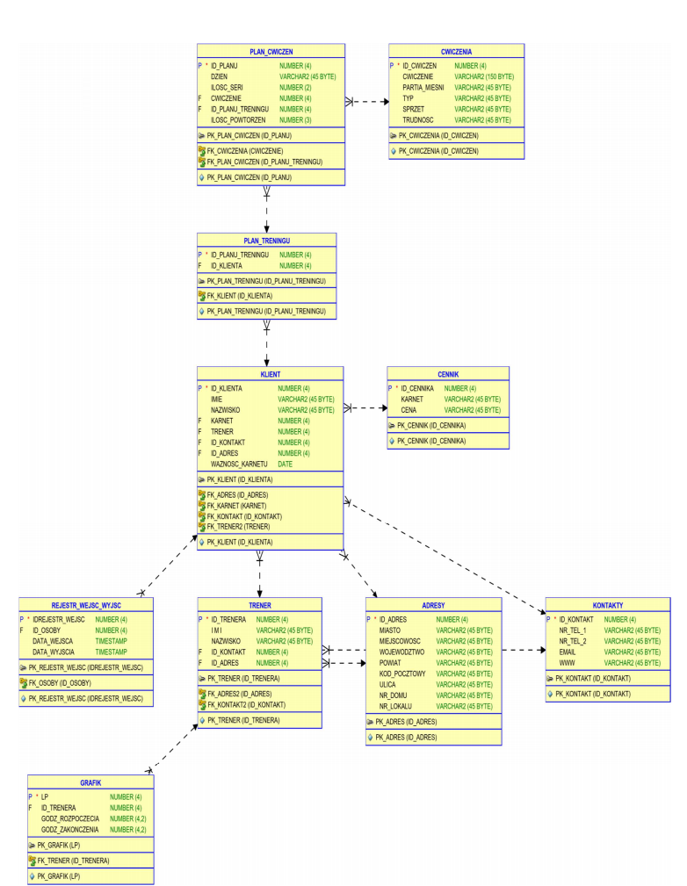

# XmlGenerator
> Jest to prosty skrypt eksportujacy rekordy w bazie danych do pliku w formacie xml, oraz iportujacy do bazy danych rekordu z pliku w formacie xml

## Table of contents
* [General info](#general-info)
* [Technologies](#technologies)
* [Setup](#setup)
* [Status](#status)

## General info
Skrypt pobiera dane z bazy, które sa zapisywane  do formatu XML, a następnie z wykorzystaniem schematów odpowiednio
prezentowane. Aplikacja Działa w dwie strony. Dane, które są zapisane w formacie XML
mogą zostać zapisane do bazy danych. 

## Technologies
* Python 3.8
* cx_oracle

## Setup
1. Należy otworzyć wiersz poleceń i należy zmienić ściężkę do folderu wkórym znajduje się generator
2. Następnie należy wywołąć komendę w wierszu poleceń:'python xml.py <argument1> <argument2><argument3>' gdzie:
   - argument1 - określamy tu czy chcemy dokonac importowania czyeksportowania xml. W tym celu wpisujemy "eksport" lub "import"
   - argument2 - jest to nazwa tabeli do, której importowac xml, lubz niej go eksportować. Dostępne wartości:
     –klient
     –trener
     –kontakty
     –cennik
     –cwiczenia
     –plan_treningu
     –Plan_cwiczen
     –Rejestr_wejsc_wyjsc
     –Adresy
   - argument3 - "nazwaPLiku.xml" - w tym argumencie podajemynazwe pliku z rozszerzeniem xml, do ktorego chemy eksportowac lub,z ktorego chcemy importowac xml. Plik zarówno do eksportu jaki importu musi znajdować sie w miejscu gdzie znajduje się skrypt"xml.py"

Przykład użycia:'python xml.py eksport rejestr_wejsc_wyjsc rejestr2.xml'

## Status
Project is:  _no longer continue_ 

